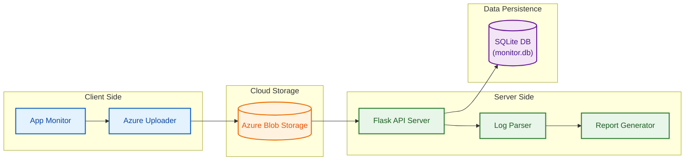

# 🖥️ Active Apps Monitor

**Active Apps Monitor** is a comprehensive system for tracking, storing, and analyzing application usage. It consists of a client-side monitor that tracks active applications and a server-side application that processes logs, manages users, and generates reports.

---

## 🚀 Features

### 📡 Client-Side Monitor
- **Real-time Monitoring**: Tracks active (foreground) applications on Windows/Linux.
- **Data Collection**: Captures window titles, process names, and timestamps.
- **Cloud Sync**: Uploads log archives to Azure Blob Storage.

### ⚙️ Server-Side Application
- **REST API**: Endpoints for managing users and log entries.
- **Azure Integration**: Downloads and processes log files directly from Azure Blob Storage.
- **SQLite Database**: Robust local storage for user management and log metadata.
- **Reporting**: Generates HTML reports from processed log data.
- **Data Parsing**: Automatically extracts and parses zipped log files.

---

## 🏗️ System Architecture



---

## 🛠️ Setup & Installation

### Prerequisites
- Python 3.8+
- Azure Storage Account (Connection String required)

### 1. Server Setup

1.  **Clone the repository**
    ```bash
    git clone <repository-url>
    cd active-apps-monitor
    ```

2.  **Create and activate a virtual environment**
    ```bash
    python3 -m venv venv
    source venv/bin/activate  # On Windows: venv\Scripts\activate
    ```

3.  **Install dependencies**
    ```bash
    pip install -r requirements.txt
    ```

4.  **Configure Environment Variables**
    Create a `.env` file in the root directory:
    ```env
    AZURE_STORAGE_CONNECTION_STRING="your_azure_connection_string"
    AZURE_CONTAINER_NAME="appmonitor"
    ```

5.  **Run the Server**
    ```bash
    python server/app.py
    ```
    The server will start on `http://localhost:5000`.

---

## 🔌 API Documentation

The server provides the following REST endpoints:

### Users
| Method | Endpoint | Description | Payload Example |
|--------|----------|-------------|-----------------|
| `GET`  | `/users` | List all users | N/A |
| `POST` | `/users` | Create a new user | `{"name": "John", "email": "john@example.com"}` |

### Logs
| Method | Endpoint | Description | Payload Example |
|--------|----------|-------------|-----------------|
| `GET`  | `/logs`  | List all log entries | N/A |
| `POST` | `/logs`  | Create a log entry | `{"user_id": 1, "log_file_url": "..."}` |

### File Operations
| Method | Endpoint | Description | Payload Example |
|--------|----------|-------------|-----------------|
| `POST` | `/files` | Download & unzip logs from Azure | `{"filename": "logs.zip"}` |
| `GET`  | `/report`| View parsed log report (HTML) | N/A |

---

## 📂 Project Structure

```
active-apps-monitor/
├── client/                 # Client-side monitoring scripts
│   ├── simple_monitor.py
│   └── windowslogger.py
├── server/                 # Server-side application
│   ├── app.py             # Main Flask application
│   └── templates/         # HTML templates
├── server_downloads/       # Temp folder for downloaded zips
├── server_extracted_logs/  # Temp folder for extracted logs
├── monitor.db             # SQLite database (auto-created)
├── requirements.txt       # Python dependencies
└── README.md              # Documentation
```
