# Active Apps Monitor

## 📖 About the Project

In an era of constant digital distractions, understanding how we spend our time on our computers is crucial for productivity. Many of us lose hours to "context switching" or unproductive applications without realizing it.

**Active Apps Monitor** is designed to solve this problem by providing a transparent, automated way to track your digital footprint. It answers the question: *"Where did my day go?"* by logging active windows and applications, analyzing the data, and providing actionable insights.

## 🛠️ How We Solve It

We tackle the problem using a three-tiered approach:
1.  **Data Collection**: A lightweight, local Python agent runs in the background, hooking into Windows APIs to detect the foreground window and process in real-time.
2.  **Cloud Synchronization**: Data is securely zipped and uploaded to Azure Blob Storage, ensuring your history is preserved across devices and sessions.
3.  **Intelligent Analysis**: We utilize a Model Context Protocol (MCP) server integrated with **Google Gemini**. This allows AI agents to "read" your productivity logs and answer questions like *"How much time did I spend coding vs. in meetings?"* or *"What was my most distracting app today?"*.

### System Architecture

```mermaid
flowchart LR
  classDef source fill:#E3F2FD,stroke:#1565C0,stroke-width:2px,color:#0D47A1;
  classDef core fill:#E8F5E9,stroke:#2E7D32,stroke-width:2px,color:#1B5E20;
  classDef storage fill:#FFF3E0,stroke:#EF6C00,stroke-width:2px,color:#E65100;
  classDef output fill:#F3E5F5,stroke:#6A1B9A,stroke-width:2px,color:#4A148C;
  classDef config fill:#EDE7F6,stroke:#3949AB,stroke-width:2px,color:#1A237E;

  OS(["Operating System<br/>(Windows / macOS / Linux)"]):::source
  Config[["Configuration & Rules<br/>(Productivity labels)"]]:::config

  subgraph Core["Active Apps Monitor Core"]
    Monitor["Foreground App Monitor<br/>(Window & Process Tracker)"]:::core
    Sessionizer["Session Builder<br/>(Start • End • Duration)"]:::core
  end

  subgraph Storage["Local Storage"]
    Logs[["Usage Logs<br/>(CSV / JSON File DB)"]]:::storage
  end

  subgraph Output["Outputs & Integrations"]
    CLI["CLI Summary & Stats"]:::output
    Export["Export for ML Analysis<br/>(Notebooks / Dashboards)"]:::output
  end

  OS --> Monitor
  Config --> Monitor
  Monitor --> Sessionizer
  Sessionizer --> Logs
  Logs --> CLI
  Logs --> Export
```



## 🚀 Current State

The project is currently a functional prototype with the following capabilities:

- ✅ **Real-time Monitoring**: Successfully tracks active window titles and process names on Windows.
- ✅ **Cloud Integration**: Fully functional upload to Azure Blob Storage.
- ✅ **Web Dashboard**: A Flask backend and React (Vite) frontend are in place to view logs.
- ✅ **AI Integration**: An MCP server is implemented to allow LLMs to query the data.
- ✅ **Privacy**: Configurable "ignore list" to filter out system noise.

## Project Structure

- **`simple_monitor.py`**: The main client script that runs on the user's machine to collect data.
- **`windowslogger.py`**: Helper module for interacting with Windows APIs.
- **`server/`**: Flask backend application (`app.py`).
- **`frontend/`**: React frontend application (Vite).
- **`productivity_mcp.py`**: MCP server for AI analysis.
- **`client/`**: Client-side scripts.

## Prerequisites

- **Python 3.8+**
- **Node.js & npm** (for the frontend)
- **Azure Storage Account** (for cloud sync)
- **Google Gemini API Key** (for AI analysis)

## Installation

1.  **Clone the repository:**
    ```bash
    git clone https://github.com/meeraaj/active-apps-monitor.git
    cd active-apps-monitor
    ```

2.  **Install Python dependencies:**
    ```bash
    pip install -r requirements.txt
    pip install mcp google-generativeai pandas  # Additional dependencies for MCP
    ```

3.  **Install Frontend dependencies:**
    ```bash
    cd frontend
    npm install
    cd ..
    ```

4.  **Environment Configuration:**
    Create a `.env` file in the root directory with the following variables:

    ```env
    # Azure Storage Configuration
    AZURE_STORAGE_CONNECTION_STRING="your_azure_connection_string"
    AZURE_CONTAINER_NAME="app-monitor-logs"

    # Flask Server Configuration
    SECRET_KEY="your_secret_key"

    # AI / MCP Configuration
    GEMINI_API_KEY="your_gemini_api_key"
    ```

## Usage

### 1. Start the Monitor (Client)

To start tracking your activity:

```bash
python simple_monitor.py
```

### 2. Start the Web Application

**Backend (Flask):**
```bash
cd server
python app.py
```

**Frontend (React):**
```bash
cd frontend
npm run dev
```
The frontend will typically run on `http://localhost:5173`.

### 3. Start the MCP Server

To enable AI analysis for MCP clients:

```bash
python productivity_mcp.py
```

## License

[MIT](LICENSE)
